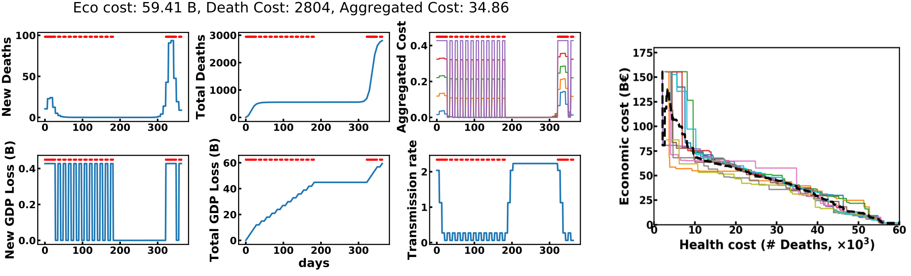

# The EpidemiOptim library

<p align="center">

</p>
<p align="center">
 <em>Left: evolution of costs and model parameters for a DQN lock-down policy DQN. Right: Pareto fronts found by 10 runs of NSGA-II.</em>
</p>


The EpidemicOptimization suite is a library that allows to interface optimization algorithms with models of epidemic propagation. Epidemiological models are wrapped in OpenAI Gym 
interfaces, making them readily compatible with state-of-the-art optimization algorithms.

This library is designed to be easily customized. The underlying propagation model, reward function, state and action spaces can be modified easily.

### What's already there

* **Epidemiological models**: This library comes with a region-based mechanistic model of the French COVID-19 epidemic fitted on real data, published [here](https://www.medrxiv.org/content/medrxiv/early/2020/04/24/2020.04.21.20073536.full.pdf).

* **Cost functions**: we include a health cost measuring the death toll, and an economic cost measuring the opportunity cost on the GDP due to the epidemic (see our paper for 
details). A multi-cost class allows to integrate the two costs.

* **Learning environments**: The 'EpidemicDiscrete-v0' environment wraps around the epidemiological model and the two cost functions described above. The agent controls the 
enforcement of a lock-down on a weekly basis. 

* **Optimization algorithms**: The library includes [NSGA-II](https://ieeexplore.ieee.org/stamp/stamp.jsp?arnumber=996017), [Deep Q-Networks](https://www.datascienceassn.org/sites/default/files/Human-level%20Control%20Through\%20Deep%20Reinforcement%20Learning.pdf) (DQN), and variants of DQN presented in our paper. 

### Requirements

The EpidemiOptim library runs with Python>=3.6. All requirements are listed in the `requirements.txt` file.

### Running an experiment

Experiments can be run with the `epidemioptim/train.py` script:

```
python train.py --config goal_dqn --expe_name goal_dqn_study --trial_id 0
```

The `--config` argument selects one of the configurations defined in `epidemioptim/configs/`. They include: ['dqn', 'goal_dqn', 'goal_dqn_constraints', 'nsga_ii'].
The `--expe_name` and `--trial_id` arguments are a string identifier of the exeperiment and an integer identifier of the specific run that will be used to organized results in 
the `data/results/` folder. 
 
### How to customize it

* **Add a module**: epidemiological models, cost functions, gym environments or optimization algorithms can be added to the library. To this end, a new python script containing 
the module class should be created in `epidemioptim/environments/models/`, `epidemioptim/environments/cost_functions/` ,`epidemioptim/environments/gym_envs/` or 
`epidemioptim/optimization/` respectively. They should inherit the corresponding base classes `BaseModel`, `BaseCost`, `BaseEnv` or `BaseAlgorithm` respectively. Finally, their 
reference should be added to their respective get functions (e.g. `epidemioptim/environments/models/get_model.py`).


### Visualization

A visualization notebook can be found in `epidemioptim/analysis/Visualization EpidemiOptim.ipynb`. It allows the interactive visualizations of one run per condition presented in
 the paper. The user will be able to tune the parameter balance the economic and health costs, to modify constraints on their maximal cumulative values, or to explore the Pareto
  front resulting from the multi-objective optimization of the NSGA-II algorithm.
  
### Please contribute !

The EpidemiOptim library can be seen as a collaborative toolbox to facilitate collaborations between people interested in the automatic design of intervention strategies in the 
context of epidemic propagation. Everyone is welcome to contribute. We are especially interested in new epidemiological models, new costs functions, new learning environments, 
new optimization algorithms and new ways to visualize the results. Feel free to contact us!

Please report any bug to us !


